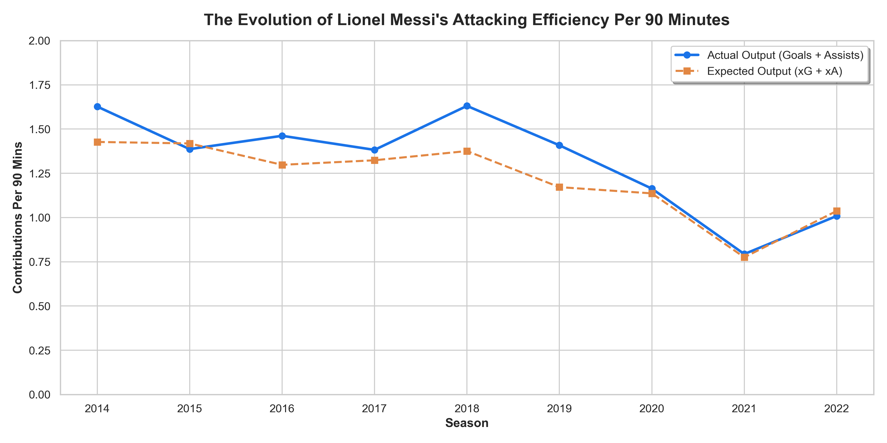
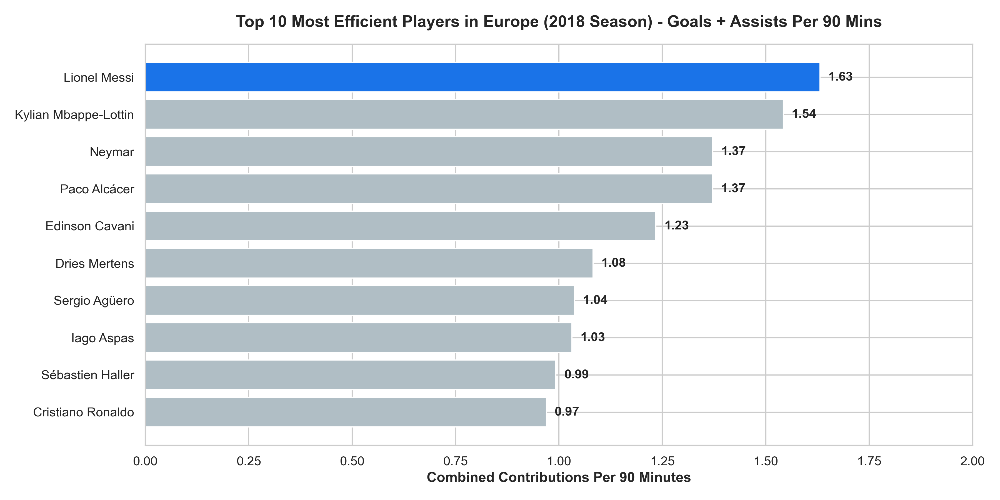

# messi-efficiency-data-analysis
A data-driven analysis of Lionel Messi's career efficiency and advanced metrics (xG/xA) using the Google Data Analytics methodolgy
# Lionel Messi: Attacking Efficiency & Playmaking Analysis (2014-2024)
A Data-Driven Exploration of Peak Performance and Model Outliers Using Understat Advanced Metrics.

## 📌 Executive Summary
This project applies the Google Data Analytics methodology to investigate the career efficiency of Lionel Messi between the 2014/15 and 2024/25 seasons. By evaluating 301 matches (approximately 283.7 full 90-minute games) across Europe's top leagues, this analysis uncovers Messi’s peak efficiency season, benchmarks his performance against European elite forwards, and evaluates his long-term sustainability against advanced mathematical models (Expected Goals - xG, and Expected Assists - xA).

---

## 🎯 Key Questions & Data Insights

### 1. Identifying the Peak Efficiency Season
* Finding: The 2018/2019 season represents the absolute pinnacle of Lionel Messi's attacking efficiency.
* Data Evidence: Messi recorded a devastating 1.63 actual goal contributions (Goals + Assists) per 90 minutes. 
* Model Outlier: In this season, his actual output significantly outperformed the mathematical expectation (1.63 Actual vs 1.37 Expected Per 90), proving an elite clinical finishing premium.

### 2. European Benchmarking (2018 Season)
* Finding: Messi operated in an entirely separate statistical tier compared to the rest of Europe.
* Data Evidence: Benchmarked against all players with a minimum of 900 minutes played, Messi ranked #1 in Europe (1.63 Per 90), outclassing explosive seasons from Kylian Mbappé (1.54 Per 90) and Neymar Jr. (1.37 Per 90).
* Sample Sustainability: Unlike competitors with smaller match samples (e.g., Neymar at 17 games), Messi maintained this historical efficiency over a grueling 34-match sample size.

### 3. Career Sustainability: Finishing vs. Playmaking Premiums
* The Finishing Premium (+33.11): Over 301 tracked matches, Messi scored 253 goals against an expected xG model of 219.89. This lifetime surplus of +33.11 goals over expectation proves that defying mathematical models is a permanent trait of his career, not a temporary peak.
* The Playmaking Premium (-3.81): Messi provided 126 actual assists against a lifetime Expected Assists (xA) model of 129.81. This negative premium (-3.81) serves as statistical proof of teammate finishing inefficiency, indicating that his passing created high-quality chances that were under-converted by his peers.

---

## 🛠️ Data Methodology & Pipeline
* Ask: Formulated business questions targeting peak performance, elite benchmarking, and model divergence.
* Prepare: Utilized a comprehensive Kaggle dataset derived from Understat, containing 35,076 rows of player-level advanced metrics.
* Process: Filtered out goalkeepers and applied a 900-minute minimum threshold per season to eliminate small-sample-size anomalies. 
* Analyze & Share: Engineered normalized "Per 90" metrics to ensure statistical fairness. Generated career trend lines and localized benchmarking bar charts using matplotlib and seaborn (saved under /figures).

---

## 📊 Visualizations Portfolio
The following insights were plotted and saved during the pipeline execution:

